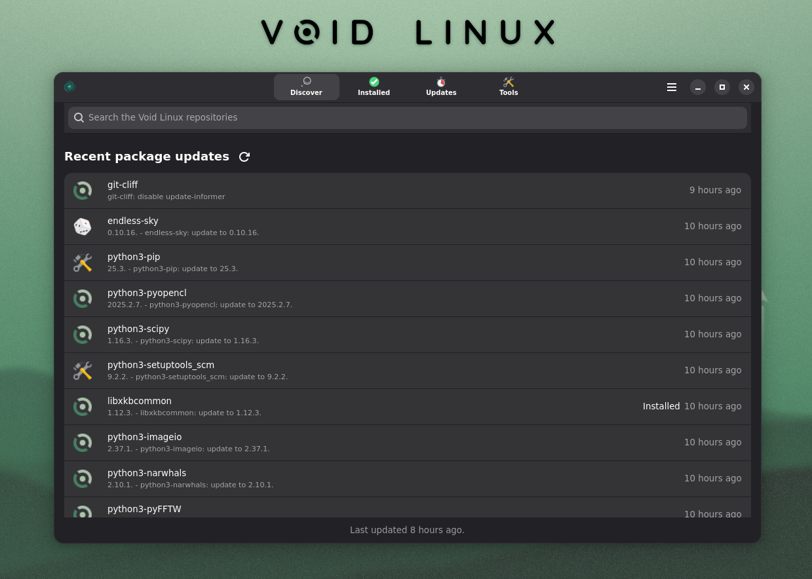
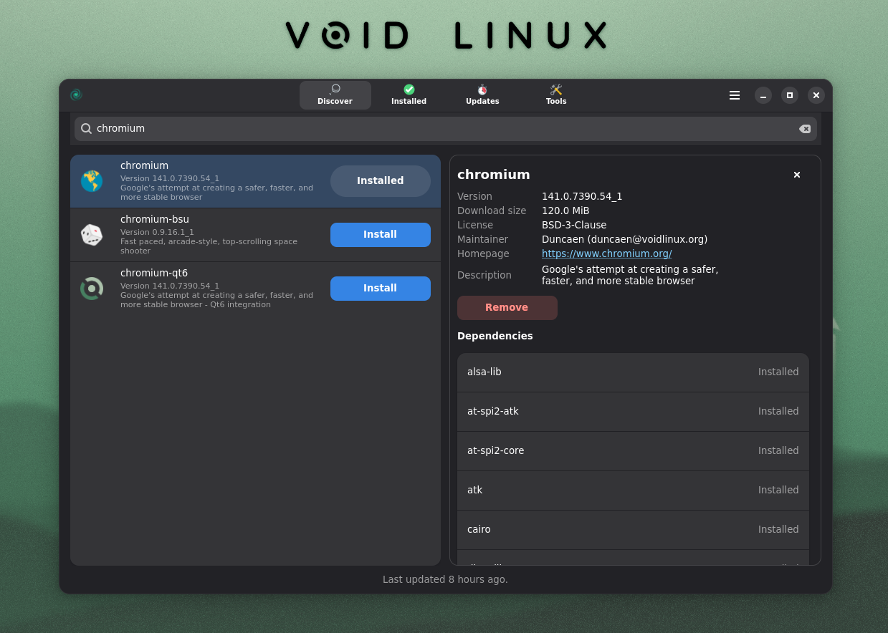
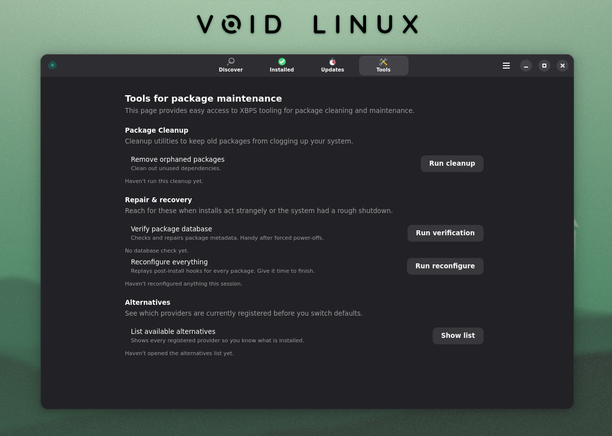
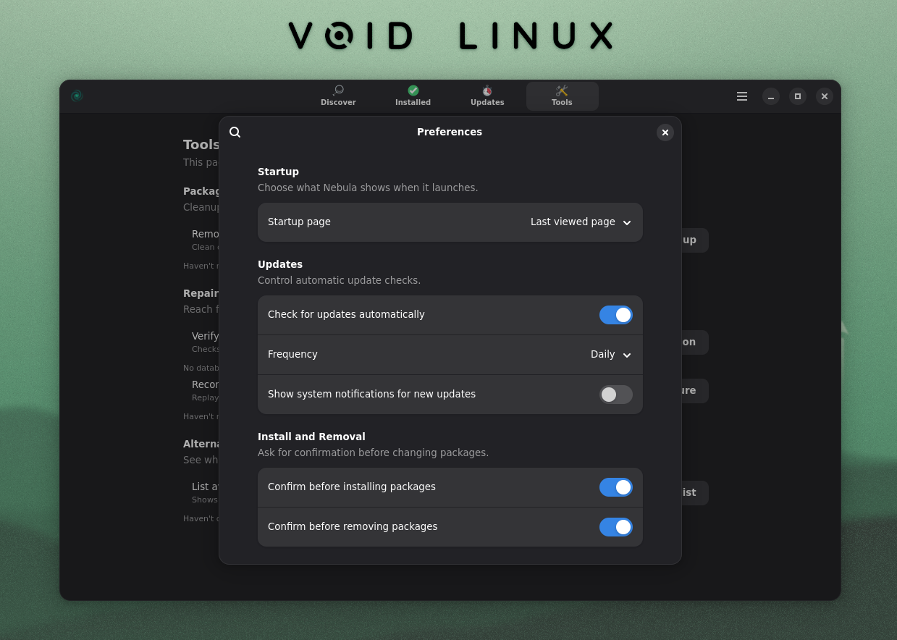

# Nebula

Nebula is a GTK/libadwaita front-end for browsing and managing Void Linux packages, using the XBPS tooling in the background.

## Screenshots

|  |  |
| --- | --- |
|  |  |

## Requirements

- A Void Linux installation
- GTK 4.14+ and libadwaita 1.4+ runtimes
- Rust 1.88.0 or newer (tested with 1.88.0)

## Quick Start

```sh
cargo run --bin nebula-gtk
```

## Production Build

```sh
cargo build --release --bin nebula-gtk
```

The optimized binary is written to `target/release/nebula-gtk`. Use `cargo run --release nebula-gtk` if you want to execute the release build directly after compiling.

## System Install

```sh
sudo ./setup.sh install
```

The helper script builds the release binary, installs it into `/usr/libexec`, registers the desktop entry, and copies the icon set into the standard `hicolor` theme directories. Use `sudo ./setup.sh uninstall` to remove those assets.

## Category Data

- Clone `void-linux/void-packages` into `vendor/void-packages` to supply package metadata.
- Regenerate the curated suggestions file when the repository changes:

  ```sh
  SKIP_GRESOURCE=1 cargo run --bin category_harvest
  ```

- Hand edits live in `data/category_overrides.toml`; the generated dataset is saved to `data/generated/category_suggestions.json`.
